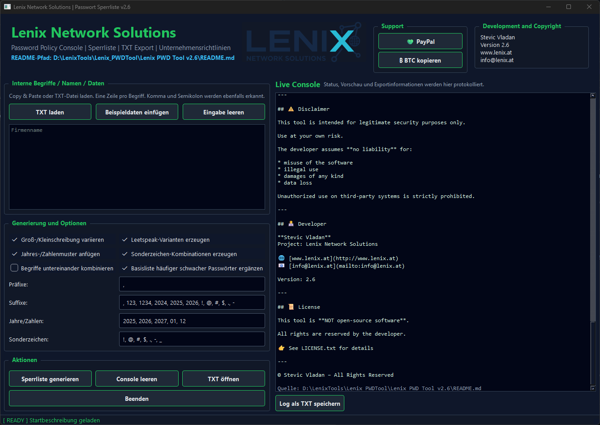

## ✨ Description

A GUI tool for generating custom password deny lists for enterprise environments.
This tool helps identify and block weak or company-related passwords.

---

## ✨ Features

* Generate password deny lists based on:
* internal company data (names, departments, projects, etc.)
* Variations:
* case variations
* numbers
* special characters
* Leetspeak (e.g. a → @, o → 0)
* Word combinations
* Export as `.txt` file
  → **one password per line**
* Live console preview

---

## 🖥️ Usage

1. Enter terms or load a `.txt` file
2. Select options
3. Click “Generate deny list”
4. Export the result
   
SHA256-Hash von Lenix_PWD_Policy_Tool_v2.6.zip
464a229b45219fe7155e4fbeaf476fd62c8561f5fd9b3be27fd0eb47a6630f37

## ❤️ Support

This tool is provided free of charge.
If you like this tool, consider supporting it:

**PayPal:**
https://www.paypal.com/paypalme/legenda1986

**Bitcoin:**
BC1QJ4LMJ8CG4QJ8GA7AN9YEPRL38UM2M88DGY9SV9

---

## ⚠️ Disclaimer

This tool is intended for legitimate security purposes only.
Use at your own risk.
The developer assumes **no liability** for:

* misuse of the software
* illegal use
* damages of any kind
* data loss

Unauthorized use on third-party systems is strictly prohibited.

---

## 👨‍💻 Developer

**Stevic Vladan**
Project: Lenix Network Solutions

🌐 [www.lenix.at](http://www.lenix.at)
📧 [info@lenix.at](mailto:info@lenix.at)

Version: 2.6

---

## 📜 License

This tool is **NOT open-source software**.
All rights are reserved by the developer.

👉 See LICENSE.txt for details

---

© Stevic Vladan – All Rights Reserved
