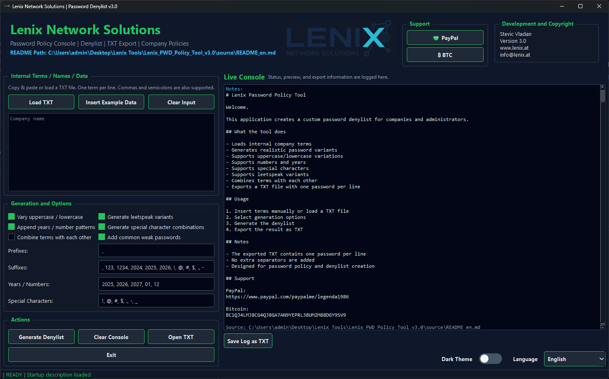

# 🚀 Lenix Password Policy Tool v3.0

A major update focused on **internationalization, usability, and clean structure**.

---

## 🌍 Multi-Language Support

The application now supports multiple languages directly in the GUI:

* 🇬🇧 English (default)
* 🇩🇪 German
* 🇷🇸 Serbian (Cyrillic)
* 🇷🇺 Russian
* 🇪🇸 Spanish

✔ Language can be changed live via dropdown
✔ README is automatically loaded based on selected language

---

## 🎨 New UI Improvements

* 🌗 Dark & Light Theme switch (toggle inside the app)
* 🧠 Improved layout and usability
* ⚙️ Settings area now includes:

  * Theme switch
  * Language selector

---

## 📁 New File Structure

All resources are now organized in a clean `source/` directory:

```text
source/
├─ README_en.md
├─ README_de.md
├─ README_sr.md
├─ README_ru.md
├─ README_es.md
├─ Logo-01.png
└─ app.ico
```

✔ Easier maintenance
✔ Ready for future updates and scaling

---

## ⚙️ Core Features

* Generate password denylist based on:

  * Company terms
  * Names, departments, locations
* Advanced variations:

  * Upper/lowercase
  * Leetspeak
  * Numbers & years
  * Special characters
* Combine words automatically
* Export as TXT (1 password per line)

---

## ⚠️ Security Notice

This tool is designed for:

* Password policy creation
* Security awareness
* Internal IT testing

❗ **Do not use for unauthorized or illegal activities**

---

## 💚 Support the Project

If you like this tool, feel free to support:

**PayPal**
https://www.paypal.com/paypalme/legenda1986

**Bitcoin**
`BC1QJ4LMJ8CG4QJ8GA7AN9YEPRL38UM2M88DGY9SV9`

---

## 📦 Download

👉 Include SHA256 hash with your release for verification

---

## 🔄 Version

**v3.0**

* Full multi-language support
* New UI controls
* New structured resource system

---

## ⭐ Feedback

Feel free to:

* Open issues
* Suggest features
* Share improvements

---

🔥 More tools coming soon under **Lenix Network Solutions**
